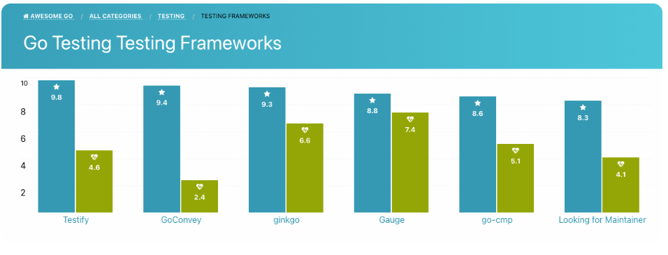
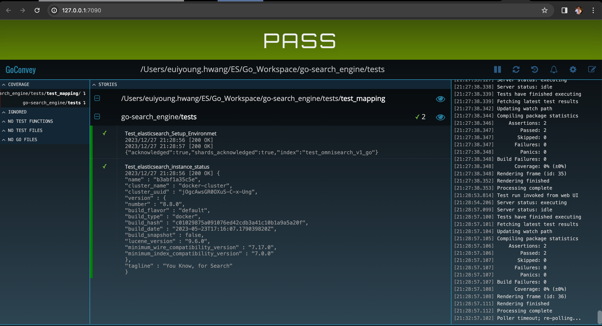

# go-search_engine


#### Go Env
```bash
xcode-select --install
/bin/bash -c "$(curl -fsSL https://raw.githubusercontent.com/Homebrew/install/master/install.sh)"
brew install go
go env
go version
```


#### Run Go
```bash
go mod init go-search_engine
go run ./sample/hello.go
go build ./sample/hello.go && ./sample/hello
```


#### Run Docker with sample
```bash
go get github.com/labstack/echo/v4
go get github.com/labstack/echo/v4/middleware

go-search_engine git:(master) ✗ go run ./main.go                             

   ____    __
  / __/___/ /  ___
 / _// __/ _ \/ _ \
/___/\__/_//_/\___/ v4.11.4
High performance, minimalist Go web framework
https://echo.labstack.com
____________________________________O/_______
                                    O\
⇨ http server started on [::]:9080


curl http://localhost:9080/
curl http://localhost:9080/health

{"time":"2023-12-23T14:39:42.970473-06:00","id":"","remote_ip":"127.0.0.1","host":"localhost:9080","method":"GET","uri":"/","user_agent":"curl/7.78.0","status":200,"error":"","latency":1875,"latency_human":"1.875µs","bytes_in":0,"bytes_out":13}
{"time":"2023-12-23T14:40:07.332221-06:00","id":"","remote_ip":"127.0.0.1","host":"localhost:9080","method":"GET","uri":"/health","user_agent":"curl/7.78.0","status":200,"error":"","latency":70208,"latency_human":"70.208µs","bytes_in":0,"bytes_out":14}
```


#### Build Swag
```bash

1) 
# https://wookiist.dev/103

export PATH=$(go env GOPATH)/bin:$PATH


# http://localhost:9080/swagger/index.html

$ go get github.com/swaggo/swag/cmd/swag
$ go get github.com/swaggo/echo-swagger

# https://github.com/swaggo/swag/issues/197
go install github.com/swaggo/swag/cmd/swag@latest

$ swag 

# or $ swag init -g something.go
$ swag init 

# You can see directory like docs
docs
├── docs.go
├── swagger.json
└── swagger.yaml

0 directories, 3 files


2) 
# https://dadev.tistory.com/entry/GO-RESTAPI-%EB%AC%B8%EC%84%9C%ED%99%94-%EB%8F%84%EA%B5%AC-Swagger-Gin-Framework-%EC%A0%81%EC%9A%A9%ED%95%98%EA%B8%B0

# http://localhost:9081/docs/index.html

go get -u github.com/swaggo/swag/cmd/swag

$ swag 
# or $ swag init -g something.go
$ swag init 

go get -u github.com/swaggo/gin-swagger
go get -u github.com/swaggo/files


```

#### Elasticsearh Cluster Diagnostics (Support by Elasticsearch)
- The support diagnostic utility is a Java application that can interrogate a running Elasticsearch cluster or Logstash process to obtain data about the state of the cluster at that point in time. It is compatible with all versions of Elasticsearch (including alpha, beta and release candidates), and for Logstash versions greater than 5.0, and for Kibana v6.5+. The release version of the diagnostic is independent of the Elasticsearch, Kibana or Logstash version it is being run against.
- `Diagnostics Guide` <i>(https://olamideolajide.medium.com/how-to-collect-diagnostics-for-a-cloud-elasticsearch-cluster-4a20841a815a, https://github.com/elastic/support-diagnostics/releases/tag/8.0.3)</i>
```bash
python-elasticsearch git:(master) ✗ ./support-diagnostics-8.0.3/diagnostics.sh --host localhost --port 9209
Using /usr/bin/java as Java Runtime
Using -Xms256m -Xmx2000m  for options.
Processing diagnosticInputs...

Creating temp directory: /Users/euiyoung.hwang/ES/Python_Workspace/python-elasticsearch/local-diagnostics
Configuring log file.
Checking for diagnostic version updates.
Issue encountered while checking diagnostic version for updates.
Failed to get current diagnostic version from Github.
If Github is not accessible from this environemnt current supported version cannot be confirmed.
Getting Elasticsearch Version.
Checking the supplied hostname against the node information retrieved to verify location. This may take some time.
...
Results written to: /Users/euiyoung.hwang/ES/Python_Workspace/python-elasticsearch/local-diagnostics/commercial/watcher_stack.json
Results written to: /Users/euiyoung.hwang/ES/Python_Workspace/python-elasticsearch/local-diagnostics/commercial/xpack.json
Writing diagnostic manifest.
Closing logger.
Archiving diagnostic results.
Archive: /Users/euiyoung.hwang/ES/Python_Workspace/python-elasticsearch/local-diagnostics-20231215-160457.tar.gz was created
Deleted directory: /Users/euiyoung.hwang/ES/Python_Workspace/python-elasticsearch/local-diagnostics.
```


#### Go Testing Framework



GoConvey(<i>https://github.com/smartystreets/goconvey</i>) supports Go's native testing package. Neither the web UI nor the DSL are required; you can use either one independently.
Directly integrates with go test; Fully-automatic web UI (works with native Go tests, too)
- Directly integrates with go test
- Fully-automatic web UI (works with native Go tests, too)
- Huge suite of regression tests
- Shows test coverage
- Readable, colorized console output (understandable by any manager, IT or not)
- Test code generator
- Desktop notifications (optional)
- Immediately open problem lines in Sublime Text (some assembly required)
```bash
go get github.com/smartystreets/goconvey
go install github.com/smartystreets/goconvey

cd /Users/euiyoung.hwang/go/pkg/mod/github.com/smartystreets/goconvey@v1.8.1

go-search_engine git:(master) ✗ /Users/euiyoung.hwang/go/bin/goconvey --workDir=$SCRIPTDIR/tests
go-search_engine git:(master) ✗ ./go_convey.sh                                                                                              
2023/12/27 14:07:14 goconvey.go:116: GoConvey server: 
2023/12/27 14:07:14 goconvey.go:121:   version: v1.8.1
2023/12/27 14:07:14 goconvey.go:122:   host: 127.0.0.1
2023/12/27 14:07:14 goconvey.go:123:   port: 8080
...
```
- GoConvey : http://127.0.0.1:7090/
- /Users/euiyoung.hwang/go/bin/goconvey --workDir=$SCRIPTDIR/tests --port=7090




#### Unit-Test
```bash
➜  go-search_engine git:(master) ✗ ./unit_test.sh
=== RUN   Test_elastic
--- PASS: Test_elastic (0.03s)
PASS
ok      go-search_engine/tests  0.142s
```