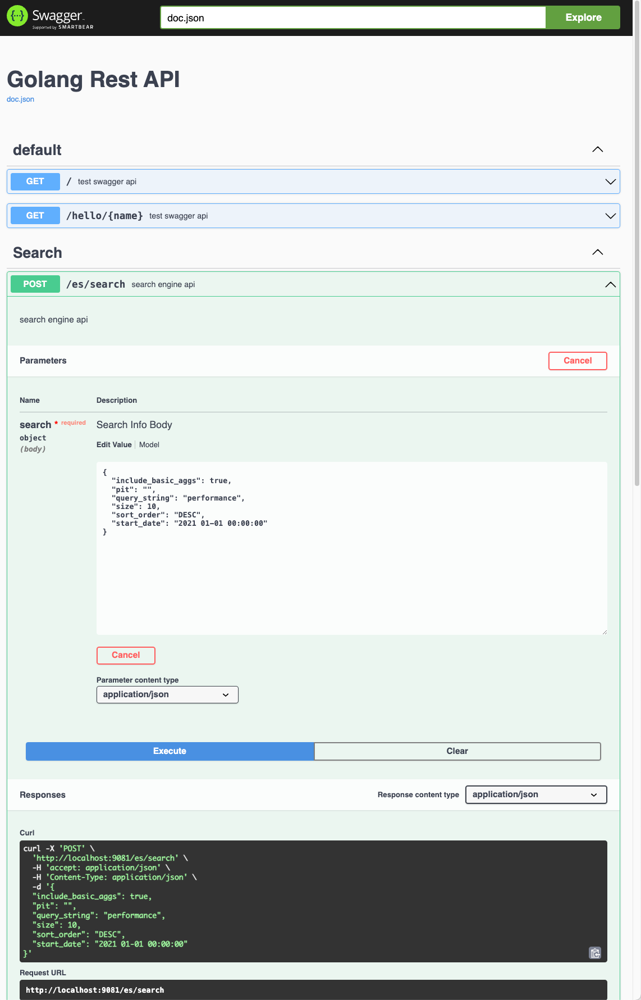
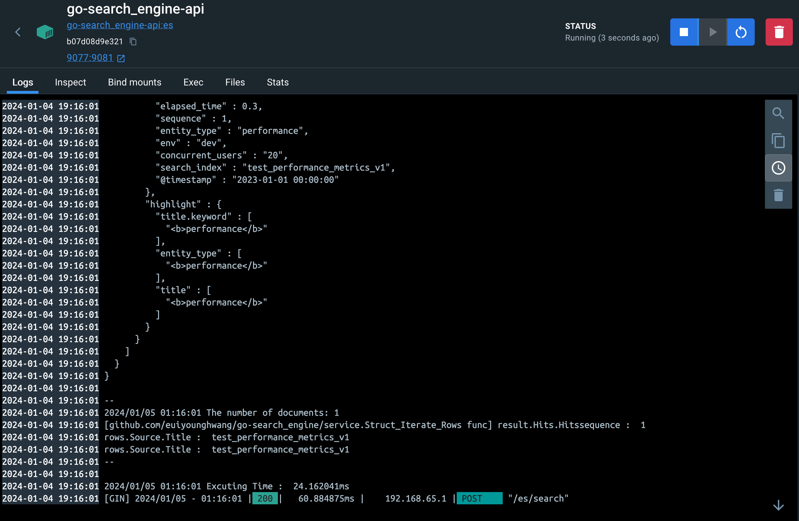

# go-search_engine


#### Go Env
```bash
xcode-select --install
/bin/bash -c "$(curl -fsSL https://raw.githubusercontent.com/Homebrew/install/master/install.sh)"
brew install go
go env
go version
```


#### Run Go
```bash
go mod init go-search_engine
go run ./sample/hello.go
go build ./sample/hello.go && ./sample/hello
```


#### Run Docker with sample
```bash
go get github.com/labstack/echo/v4
go get github.com/labstack/echo/v4/middleware

go mod tidy

go-search_engine git:(master) ✗ go run ./main.go                             

   ____    __
  / __/___/ /  ___
 / _// __/ _ \/ _ \
/___/\__/_//_/\___/ v4.11.4
High performance, minimalist Go web framework
https://echo.labstack.com
____________________________________O/_______
                                    O\
⇨ http server started on [::]:9080


curl http://localhost:9080/
curl http://localhost:9080/health

{"time":"2023-12-23T14:39:42.970473-06:00","id":"","remote_ip":"127.0.0.1","host":"localhost:9080","method":"GET","uri":"/","user_agent":"curl/7.78.0","status":200,"error":"","latency":1875,"latency_human":"1.875µs","bytes_in":0,"bytes_out":13}
{"time":"2023-12-23T14:40:07.332221-06:00","id":"","remote_ip":"127.0.0.1","host":"localhost:9080","method":"GET","uri":"/health","user_agent":"curl/7.78.0","status":200,"error":"","latency":70208,"latency_human":"70.208µs","bytes_in":0,"bytes_out":14}
```


#### Build Swagger
- Gin is a HTTP web framework (<i>https://github.com/gin-gonic/gin</i>) written in Golang. It features a Martini-like API, but with performance up to 40 times faster than Martini. If you need performance and productivity, you will love Gin.
- Gin is a high-performance micro-framework that can be used to build web applications and microservices. It makes it simple to build a request handling pipeline from modular, reusable pieces. It does this by allowing you to write middleware that can be plugged into one or more request handlers or groups of request handlers.

```bash

1) 
# https://wookiist.dev/103

export PATH=$(go env GOPATH)/bin:$PATH


# http://localhost:9080/swagger/index.html

$ go get github.com/swaggo/swag/cmd/swag
$ go get github.com/swaggo/echo-swagger

# https://github.com/swaggo/swag/issues/197
go install github.com/swaggo/swag/cmd/swag@latest

$ swag 

# or $ swag init -g something.go
$ swag init 

# You can see directory like docs
docs
├── docs.go
├── swagger.json
└── swagger.yaml

0 directories, 3 files


2) 

# https://github.com/swaggo/gin-swagger
# https://santoshk.dev/posts/2022/how-to-integrate-swagger-ui-in-go-backend-gin-edition/
# https://dadev.tistory.com/entry/GO-RESTAPI-%EB%AC%B8%EC%84%9C%ED%99%94-%EB%8F%84%EA%B5%AC-Swagger-Gin-Framework-%EC%A0%81%EC%9A%A9%ED%95%98%EA%B8%B0

# http://localhost:9081/docs/index.html

go get -u github.com/swaggo/swag/cmd/swag

$ swag 
# or $ swag init -g something.go
$ swag init 

go get -u github.com/swaggo/gin-swagger
go get -u github.com/swaggo/files

go mod tidy
```



#### Elasticsearh Cluster Diagnostics (Support by Elasticsearch)
- The support diagnostic utility is a Java application that can interrogate a running Elasticsearch cluster or Logstash process to obtain data about the state of the cluster at that point in time. It is compatible with all versions of Elasticsearch (including alpha, beta and release candidates), and for Logstash versions greater than 5.0, and for Kibana v6.5+. The release version of the diagnostic is independent of the Elasticsearch, Kibana or Logstash version it is being run against.
- `Diagnostics Guide` <i>(https://olamideolajide.medium.com/how-to-collect-diagnostics-for-a-cloud-elasticsearch-cluster-4a20841a815a, https://github.com/elastic/support-diagnostics/releases/tag/8.0.3)</i>
```bash
python-elasticsearch git:(master) ✗ ./support-diagnostics-8.0.3/diagnostics.sh --host localhost --port 9209
Using /usr/bin/java as Java Runtime
Using -Xms256m -Xmx2000m  for options.
Processing diagnosticInputs...

Creating temp directory: /Users/euiyoung.hwang/ES/Python_Workspace/python-elasticsearch/local-diagnostics
Configuring log file.
Checking for diagnostic version updates.
Issue encountered while checking diagnostic version for updates.
Failed to get current diagnostic version from Github.
If Github is not accessible from this environemnt current supported version cannot be confirmed.
Getting Elasticsearch Version.
Checking the supplied hostname against the node information retrieved to verify location. This may take some time.
...
Results written to: /Users/euiyoung.hwang/ES/Python_Workspace/python-elasticsearch/local-diagnostics/commercial/watcher_stack.json
Results written to: /Users/euiyoung.hwang/ES/Python_Workspace/python-elasticsearch/local-diagnostics/commercial/xpack.json
Writing diagnostic manifest.
Closing logger.
Archiving diagnostic results.
Archive: /Users/euiyoung.hwang/ES/Python_Workspace/python-elasticsearch/local-diagnostics-20231215-160457.tar.gz was created
Deleted directory: /Users/euiyoung.hwang/ES/Python_Workspace/python-elasticsearch/local-diagnostics.
```


#### Go Testing Framework


GoConvey(<i>https://github.com/smartystreets/goconvey</i>) supports Go's native testing package. Neither the web UI nor the DSL are required; you can use either one independently.
Directly integrates with go test; Fully-automatic web UI (works with native Go tests, too)
- Directly integrates with go test
- Fully-automatic web UI (works with native Go tests, too)
- Huge suite of regression tests
- Shows test coverage
- Readable, colorized console output (understandable by any manager, IT or not)
- Test code generator
- Desktop notifications (optional)
- Immediately open problem lines in Sublime Text (some assembly required)
```bash
go get github.com/smartystreets/goconvey
go install github.com/smartystreets/goconvey

cd /Users/euiyoung.hwang/go/pkg/mod/github.com/smartystreets/goconvey@v1.8.1

go-search_engine git:(master) ✗ /Users/euiyoung.hwang/go/bin/goconvey --workDir=$SCRIPTDIR/tests
go-search_engine git:(master) ✗ ./go_convey.sh                                                                                              
2023/12/27 14:07:14 goconvey.go:116: GoConvey server: 
2023/12/27 14:07:14 goconvey.go:121:   version: v1.8.1
2023/12/27 14:07:14 goconvey.go:122:   host: 127.0.0.1
2023/12/27 14:07:14 goconvey.go:123:   port: 8080
...
```
- GoConvey : http://127.0.0.1:7090/
- /Users/euiyoung.hwang/go/bin/goconvey --workDir=$SCRIPTDIR/tests --port=7090


## Docker build
```
docker build \
  -f "$(dirname "$0")/Dockerfile" \
  -t go-search_engine-api:es \
  --target runtime \
  "$(dirname "$0")/."
```

## Docker run
```
docker run --rm -it -d \
  --name go-search_engine-api --publish 9077:9081 --expose 9081 \
  --network bridge \
  -e ES_HOST=http://host.docker.internal:9209 \
  -v "$SCRIPTDIR:/app" \
  go-search_engine-api:es
```




#### Unit-Test
```bash
 go-search_engine git:(master) ✗ ./unit_test.sh
2024/01/04 22:07:35 Set_Env :  http://localhost:9209
=== RUN   TestHealthCheckHandler
&{GET /health HTTP/1.1 1 1 map[Tracing-Id:[123]] {} <nil> 0 [] false example.com map[] map[] <nil> map[] 192.0.2.1:1234 /health <nil> <nil> <nil> <nil>}
&{200 map[Content-Type:[application/json] Tracing-Id:[123]] {"alive": true} false <nil> map[Tracing-Id:[123]] true}
--- PASS: TestHealthCheckHandler (0.00s)
=== RUN   TestCreateUser
=== RUN   TestCreateUser/should_return_200_status_ok
&{0x1400012e300 0x140000a6420  [] [] map[] 0x102833150 map[] 0x140000dcb40 <nil> {{0 0} 0 0 {{} 0} {{} 0}}}
--- PASS: TestCreateUser (0.00s)
    --- PASS: TestCreateUser/should_return_200_status_ok (0.00s)
=== RUN   Test_elasticsearch_instance_status
2024/01/04 22:07:35 [200 OK] {
  "name" : "b3abf1a35c5e",
  "cluster_name" : "docker-cluster",
  "cluster_uuid" : "jOgcAwsGR0OXuS-C-x-Ung",
  "version" : {
    "number" : "8.8.0",
    "build_flavor" : "default",
    "build_type" : "docker",
    "build_hash" : "c01029875a091076ed42cdb3a41c10b1a9a5a20f",
    "build_date" : "2023-05-23T17:16:07.179039820Z",
    "build_snapshot" : false,
    "lucene_version" : "9.6.0",
    "minimum_wire_compatibility_version" : "7.17.0",
    "minimum_index_compatibility_version" : "7.0.0"
  },
  "tagline" : "You Know, for Search"
}

--- PASS: Test_elasticsearch_instance_status (0.00s)
=== RUN   Test_elasticsearch_configuration_to_local
2024/01/04 22:07:35 [200 OK] 
2024/01/04 22:07:35 [200 OK] 
2024/01/04 22:07:35 try_create_index - {
    "acknowledged": true,
    "shards_acknowledged": true,
    "index": "test_ngram_v1"
}
2024/01/04 22:07:35 ioUtil  
2024/01/04 22:07:35 res.Body type -  *http.gzipReader
2024/01/04 22:07:35 body type -  []uint8
2024/01/04 22:07:35 Uint8_to_Map type -  map[string]interface {}
2024/01/04 22:07:35 Json : map[acknowledged:%!s(bool=true) index:test_ngram_v1 shards_acknowledged:%!s(bool=true)], parsing : test_ngram_v1, %!s(bool=true)
2024/01/04 22:07:35 try_create_index - {
    "acknowledged": true,
    "shards_acknowledged": true,
    "index": "test_performance_metrics_v1"
}
2024/01/04 22:07:35 ioUtil  
2024/01/04 22:07:35 res.Body type -  *http.gzipReader
2024/01/04 22:07:35 body type -  []uint8
2024/01/04 22:07:35 Uint8_to_Map type -  map[string]interface {}
2024/01/04 22:07:35 Json : map[acknowledged:%!s(bool=true) index:test_performance_metrics_v1 shards_acknowledged:%!s(bool=true)], parsing : test_performance_metrics_v1, %!s(bool=true)
2024/01/04 22:07:35 [200 OK] {"acknowledged":true}
2024/01/04 22:07:35 Index_with_document - {
    "_index": "test_performance_metrics_v1",
    "_id": "111",
    "_version": 1,
    "result": "created",
    "forced_refresh": true,
    "_shards": {
        "total": 1,
        "successful": 1,
        "failed": 0
    },
    "_seq_no": 0,
    "_primary_term": 1
}
--- PASS: Test_elasticsearch_configuration_to_local (0.21s)
=== RUN   Test_elasticsearch_api
2024/01/04 22:07:35 Test_elasticsearch_api  [200 OK] {"_index":"test_performance_metrics_v1","_id":"111","_version":1,"_seq_no":0,"_primary_term":1,"found":true,"_source":{
                                "title" :  "performance",
                                "elapsed_time": 0.3,
                                "sequence": 1,
                                "entity_type": "performance",
                                "env" :  "dev",
                                "concurrent_users" :  "20",
                                "search_index" :  "test_performance_metrics_v1",
                                "@timestamp" : "2023-01-01 00:00:00"
                                }} *http.gzipReader
2024/01/04 22:07:35 response_map : map[_id:111 _index:test_performance_metrics_v1 _primary_term:%!s(float64=1) _seq_no:%!s(float64=0) _source:map[@timestamp:2023-01-01 00:00:00 concurrent_users:20 elapsed_time:%!s(float64=0.3) entity_type:performance env:dev search_index:test_performance_metrics_v1 sequence:%!s(float64=1) title:performance] _version:%!s(float64=1) found:%!s(bool=true)]
--- PASS: Test_elasticsearch_api (0.00s)
=== RUN   Test_elasticsearch_search
2024/01/04 22:07:35 [200 OK] {
  "took" : 0,
  "timed_out" : false,
  "_shards" : {
    "total" : 1,
    "successful" : 1,
    "skipped" : 0,
    "failed" : 0
  },
  "hits" : {
    "total" : {
      "value" : 1,
      "relation" : "eq"
    },
    "max_score" : 1.0,
    "hits" : [
      {
        "_index" : "test_performance_metrics_v1",
        "_id" : "111",
        "_score" : 1.0,
        "_source" : {
          "title" : "performance",
          "elapsed_time" : 0.3,
          "sequence" : 1,
          "entity_type" : "performance",
          "env" : "dev",
          "concurrent_users" : "20",
          "search_index" : "test_performance_metrics_v1",
          "@timestamp" : "2023-01-01 00:00:00"
        }
      }
    ]
  }
}

2024/01/04 22:07:35 [200 OK] 1 hits; took: 0ms
#$%% map[@timestamp:2023-01-01 00:00:00 concurrent_users:20 elapsed_time:0.3 entity_type:performance env:dev search_index:test_performance_metrics_v1 sequence:1 title:performance]
#$%% test_performance_metrics_v1
simple test k 0 v map[_id:111 _index:test_performance_metrics_v1 _score:1 _source:map[@timestamp:2023-01-01 00:00:00 concurrent_users:20 elapsed_time:0.3 entity_type:performance env:dev search_index:test_performance_metrics_v1 sequence:1 title:performance]]
--- PASS: Test_elasticsearch_search (0.00s)
=== RUN   Test_Get_Env
2024/01/04 22:07:35 Set_Env :  http://localhost:9209
--- PASS: Test_Get_Env (0.00s)
=== RUN   Test_PrettyJSon
{"track_total_hits" : true,"query": {"match_all" : {}},"size": 2}
--- PASS: Test_PrettyJSon (0.00s)
PASS
ok      github.com/euiyounghwang/go-search_engine/tests 0.341s
```